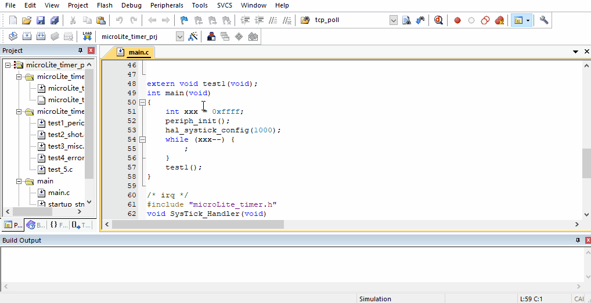
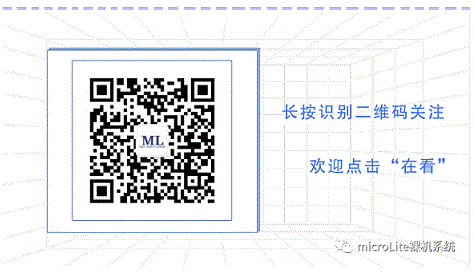

# <div align = middle>microLite_timer</div>


[](https://github.com/steven-lyan/microLite_timer/blob/main/LICENSE)
[](https://github.com/steven-lyan/microLite_timer/pulls)
[](https://blog.csdn.net/xlsbz1)
[](https://travis-ci.com/github/steven-lyan/microLite_timer)

## 简介

microLite_timer是裸机软件定时器，源自[microLite裸机系统](https://blog.csdn.net/xlsbz1/article/details/111655405)的Kernel组件，提供两类定时器机制： 

- 第一类是周期触发定时器（MLPeriod），这类定时器会周期性的触发定时器，并且“一旦启动，永不停止”。
```
#include "microLite_timer.h"
#include "stdio.h"
void test_period(void)
{
    MLPeriod.init();
    while (1) {
        MLPeriod.run();
        if (MLPeriod.check(1000)) {
            printf("timer1 timeout!\r\n");
        }
    }
}
```

- 第二类是单次触发定时器（MLShot），这类定时器在启动后只会触发一次定时器事件，然后定时器自动停止。

```
#include "microLite_timer.h"
#include "stdio.h"
static ml_shotTimer_TypeDef shot_timer1 = {0};
void test_shot(void)
{
    MLShot.start(&shot_timer1, 1000);
    while (1) {
        if (MLShot.check(&shot_timer1)) {
            printf("timer1 stop(auto)!\r\n");
        }
    }
}
```


## **源代码目录**

microLite_timer源代码目录结构如下所示：

| 名称          | 描述                                                    |
| ------------- | ------------------------------------------------------- |
| bsp           | Board Support Package（板级支持包）的移植                |
| doc           | 相关文档                                                |
| test          | 相关范例代码                                            |
| src           | microLite_timer 源文件                                |


## 文档

[microLite_timer doc](https://github.com/steven-lyan/microLite_timer/tree/main/doc/ )目录下包含了microLite_timer源代码的详细信息，包括源代码API、使用注意事项等。


## 范例

[microLite_timer test](https://github.com/steven-lyan/microLite_timer/tree/main/test/)目录下包含了microLite_timer提供的范例代码，供开发者参考。

 
## 许可协议

microLite_timer完全开源，遵循Apache License 2.0开源许可协议。


## 社区支持

非常感谢各位小伙伴的支持，在使用microLite_timer的过程中若您有任何的想法，建议或疑问都可通过以下方式进行联系。
同时，任何问题都可以在 [issue](https://github.com/steven-lyan/microLite_timer/issues) 中通过创建一个issue来描述您的问题。

- [microLite裸机系统的CSDN账号]( https://blog.csdn.net/xlsbz1) 

- 微信公众号：microLite裸机系统




## 贡献代码

如果您对microLite_timer感兴趣，并希望参与microLite_timer的开发并成为代码贡献者，请参照如下步骤：

* 1.  在您自己的GitHub账户下Fork microLite_timer 开源项目；
* 2.  根据您的需求在本地clone 一份microLite_timer 代码；
* 3.  您修改或者新增功能后，push 到您fork的远程分支；
* 4.  创建 pull request，向microLite_timer开发分支提交合入请求；
* 5.  microLite_timer作者会定期review代码，通过测试后合入。


